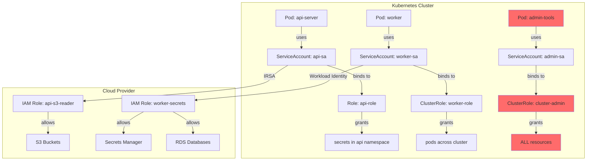
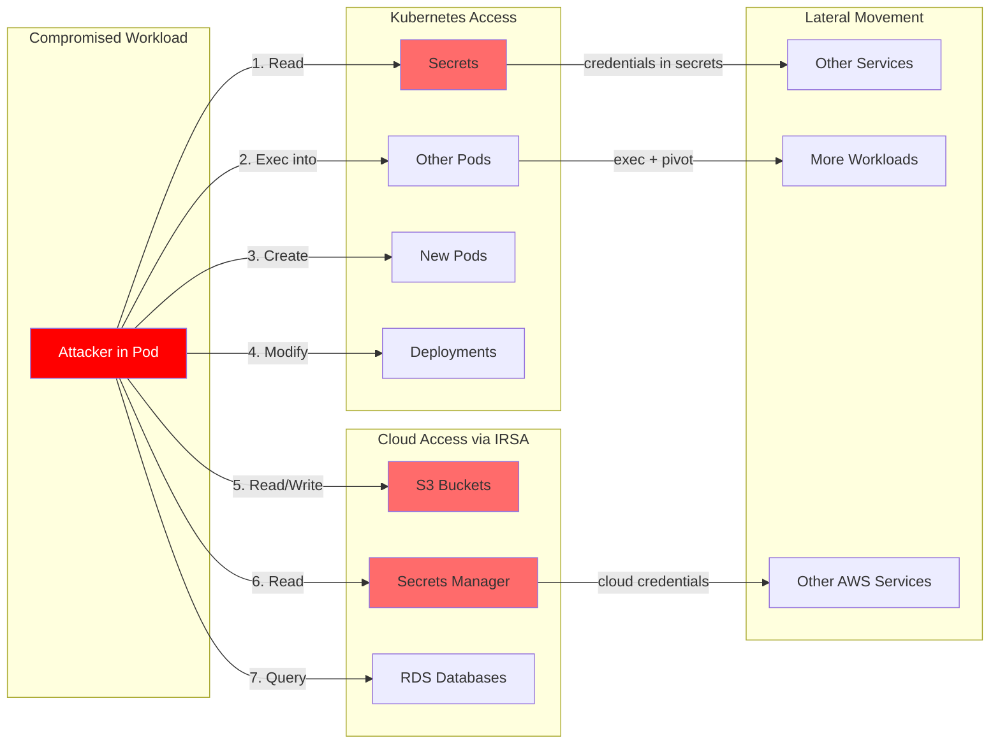
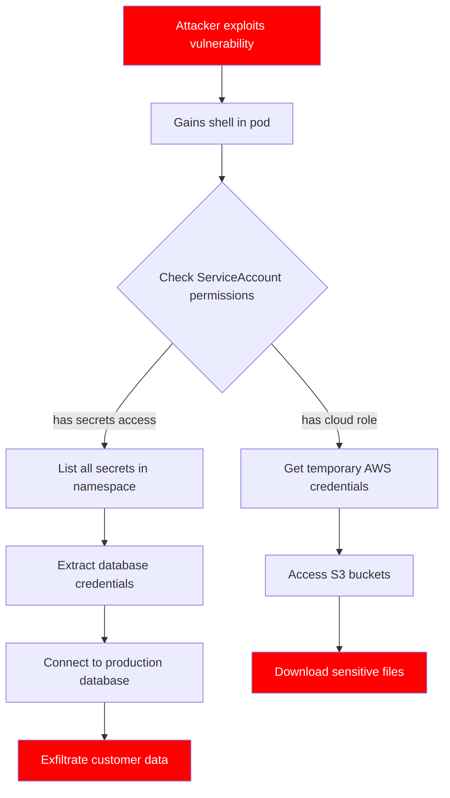
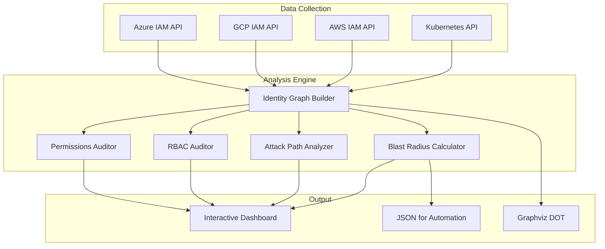
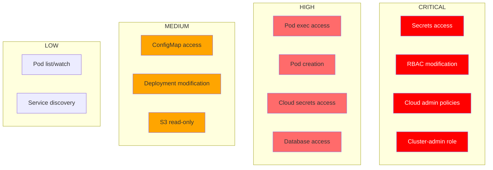

# Identity Chain (idc)

**Kubernetes Identity & Blast Radius Analyzer**

Identity Chain maps the complete identity chain from Kubernetes workloads through RBAC to cloud IAM (AWS, Azure, GCP), enabling blast radius analysis for security assessments and incident response.

Works with **EKS**, **GKE**, **AKS**, **OpenShift**, **Rancher**, and any standard Kubernetes distribution.

## The Problem

When a Kubernetes workload is compromised, security teams need to answer: **"What can the attacker access?"**

Modern Kubernetes deployments have complex identity relationships that span both cluster RBAC and cloud IAM:



**idc** traces these identity chains and calculates the blast radius - showing exactly what an attacker could access.

## Installation

### Homebrew (macOS/Linux)

```bash
brew tap nelssec/tap
brew install idc
```

### Binary Download

Download pre-built binaries from [GitHub Releases](https://github.com/nelssec/identity-chain/releases):

```bash
# macOS (Apple Silicon)
curl -sL https://github.com/nelssec/identity-chain/releases/latest/download/idc-darwin-arm64 -o idc
chmod +x idc && sudo mv idc /usr/local/bin/

# macOS (Intel)
curl -sL https://github.com/nelssec/identity-chain/releases/latest/download/idc-darwin-amd64 -o idc
chmod +x idc && sudo mv idc /usr/local/bin/

# Linux (amd64)
curl -sL https://github.com/nelssec/identity-chain/releases/latest/download/idc-linux-amd64 -o idc
chmod +x idc && sudo mv idc /usr/local/bin/

# Linux (arm64)
curl -sL https://github.com/nelssec/identity-chain/releases/latest/download/idc-linux-arm64 -o idc
chmod +x idc && sudo mv idc /usr/local/bin/
```

### From Source

```bash
git clone https://github.com/nelssec/identity-chain.git
cd identity-chain
go build -o idc ./cmd/idc/
```

## Quick Start

```bash
# Generate interactive security dashboard
idc dashboard -A --include-cloud --aws-region us-west-2 -f dashboard.html
open dashboard.html

# Scan all namespaces and show blast radius for all workloads
idc blast --all -A

# Include cloud IAM analysis (AWS)
idc blast --all -A --include-cloud --aws-region us-west-2

# Analyze a specific workload
idc blast --workload deployment/api-server -n production

# Who can access secrets?
idc whocan get secrets -A
```

## Blast Radius Analysis

If an attacker compromises a workload, they inherit its identity. The blast radius includes everything that identity can reach:



### Example Output

```
Workload: api-server (Deployment)
├── ServiceAccount: api-sa
│   ├── K8s Access:
│   │   ├── [CRITICAL] Can READ ALL SECRETS in api namespace
│   │   ├── [HIGH] Can CREATE/MODIFY PODS - potential container injection
│   │   └── [MEDIUM] Read access to configmaps
│   │
│   └── Cloud Access (AWS IRSA):
│       ├── Role: arn:aws:iam::123456789:role/api-role
│       ├── [HIGH] Read/Write S3 access to ALL buckets
│       └── [CRITICAL] Full Secrets Manager access
│
└── Blast Radius: CRITICAL
    If compromised, attacker can:
    - Read all secrets in namespace (credential exposure)
    - Access all S3 buckets in AWS account
    - Read/write all Secrets Manager secrets
```

## Attack Path Visualization

Identity Chain maps attack techniques with MITRE ATT&CK references:



## Commands

### `idc dashboard` - Interactive Security Dashboard

Generate a comprehensive HTML dashboard with all security findings.

```bash
idc dashboard -A -f security-dashboard.html
idc dashboard -A --include-cloud --aws-region us-west-2 -f dashboard.html
open dashboard.html
```

**Dashboard includes:** Overview, Blast Radius, Attack Paths, RBAC Audit, Pod Security, Network Policy, Cloud IAM, Permissions

### `idc blast` - Blast Radius Analysis

```bash
idc blast --all -A                                    # All workloads
idc blast --workload deployment/api-server -n prod   # Specific workload
idc blast --all -A --include-cloud --aws-region us-west-2  # With cloud IAM
```

### `idc attack-path` - Attack Path Analysis

```bash
idc attack-path --all -A
idc attack-path --workload deploy/api -n prod --include-cloud
```

### `idc whocan` / `idc whatcan` - RBAC Lookup

```bash
idc whocan get secrets -A                    # Who can get secrets?
idc whocan create pods -n production         # Who can create pods?
idc whatcan my-service-account -n default    # What can this SA do?
```

### `idc rbac-audit` - RBAC Security Audit

```bash
idc rbac-audit -A                            # 15 security checks
idc rbac-audit -A --checks RBAC003,RBAC005   # Specific checks
```

### `idc pod-security` - Pod Security Audit

```bash
idc pod-security -A                          # 12 PSS-based checks
```

### `idc network-policy` - Network Policy Audit

```bash
idc network-policy -A                        # 8 network policy checks
```

### `idc cloud-audit` - Cloud IAM Audit

```bash
idc cloud-audit -A --include-cloud --aws-region us-west-2
idc cloud-audit -A --include-cloud --gcp-project my-project
```

### `idc graph` - Export Identity Graph

```bash
idc graph -A -o dot > cluster.dot            # Graphviz format
dot -Tpng cluster.dot -o cluster.png
```

### `idc scan` - Cluster Statistics

```bash
idc scan -A                                  # Show cluster identity stats
```

### `idc identity` - Cloud Identity Bindings

```bash
idc identity -A                              # Show SAs with cloud bindings
idc identity -A --include-cloud --aws-region us-west-2
```

### `idc privesc` - Privilege Escalation Detection

```bash
idc privesc --all -A                         # Find privesc paths
idc privesc --workload deploy/api -n prod
```

### `idc scc` - OpenShift SCC Analysis

```bash
idc scc -A                                   # Analyze Security Context Constraints
idc scc -A --include-system                  # Include system SCCs
```

### `idc sa-lifecycle` - Service Account Lifecycle

```bash
idc sa-lifecycle -A                          # Find orphaned/unused SAs
```

### `idc generate` - Least-Privilege Role Generator

```bash
idc generate -A --audit-source cloudwatch --log-group /aws/eks/cluster/cluster
idc generate -A --audit-source gcp --gcp-project my-project --since 30d -f roles.yaml
```

### `idc unused` - Find Unused Permissions

```bash
idc unused -A --audit-source cloudwatch --log-group /aws/eks/cluster/cluster
```

### `idc remediate` - Auto-Remediation

Generate Kubernetes manifests to fix security findings:

```bash
idc remediate -A -f fixes.yaml                    # Generate all fix manifests
idc remediate -A --severity critical              # Only critical fixes
idc remediate -A --type rbac -f rbac-fixes.yaml   # Only RBAC fixes
idc remediate -A --manifests-only                 # Just YAML, no summary
```

Generates ready-to-apply YAML for:
- RBAC issues (cluster-admin, secrets access, wildcards)
- Pod security (privileged, hostNetwork, capabilities)
- Network policies (default-deny, DNS egress)

### `idc check` - Custom Security Checks

Run user-defined security checks from a YAML configuration:

```bash
idc check -A --config custom-checks.yaml
idc check -A --config checks.yaml --severity high
```

Example check configuration:
```yaml
checks:
  - id: CUSTOM001
    name: "No pods in default namespace"
    severity: medium
    match:
      kind: Workload
      namespace: default
    condition:
      exists: true
```

See `examples/custom-checks.yaml` for more examples.

### `idc clusters` - Multi-Cluster Management

Manage and scan multiple clusters:

```bash
idc clusters list                                  # List configured clusters
idc clusters add --name prod --context prod-ctx    # Add a cluster
idc clusters remove prod                           # Remove a cluster
idc clusters scan                                  # Scan all clusters
```

### `idc history` - Historical Scan Results

View historical scan data:

```bash
idc history                                        # View all scan history
idc history --cluster prod --limit 10              # Filter by cluster
```

### `idc trend` - Security Posture Trends

Analyze security trends over time:

```bash
idc trend                                          # Compare all clusters
idc trend --cluster prod --since 30d               # Single cluster trend
```

Shows:
- Finding counts over time
- Critical/High issue trends
- CIS compliance changes
- Improving/degrading/stable status

## Architecture



## Risk Classification



## Platform Support

### Kubernetes Distributions

| Distribution | Support | Notes |
|--------------|---------|-------|
| EKS | Full | IRSA cloud identity |
| GKE | Full | Workload Identity |
| AKS | Full | Workload Identity |
| OpenShift | Full | Includes SCC analysis |
| Rancher/RKE | Full | Standard RBAC |
| k3s/k0s | Full | Standard RBAC |
| Vanilla K8s | Full | Standard RBAC |

### Cloud Identity Federation

| Provider | Annotation | Flag |
|----------|------------|------|
| AWS IRSA | `eks.amazonaws.com/role-arn` | `--aws-region us-west-2` |
| GCP Workload Identity | `iam.gke.io/gcp-service-account` | `--gcp-project my-project` |
| Azure Workload Identity | `azure.workload.identity/client-id` | `--azure-subscription <id>` |

### OpenShift Security Context Constraints

On OpenShift clusters, idc automatically detects and analyzes SCCs:

```bash
idc scc -A                    # Dedicated SCC analysis
idc dashboard -A -f report.html   # SCC included in Permissions tab
```

SCC analysis includes:
- Risk scoring for each SCC (privileged, hostNetwork, hostPID, etc.)
- Risky bindings (who can use privileged SCCs)
- Escalation paths via RBAC

## Use Cases

### Security Assessment
```bash
idc dashboard -A --include-cloud --aws-region us-west-2 -f report.html
```

### Incident Response
```bash
idc blast --workload pod/compromised -n prod --include-cloud
```

### Compliance & Audit
```bash
idc blast --all -A -o json | jq '.[] | select(.max_severity == "critical")'
```

## Global Flags

| Flag | Description |
|------|-------------|
| `-n, --namespace` | Target namespace |
| `-A, --all-namespaces` | Scan all namespaces |
| `-o, --output` | Output format: table, json, dot |
| `-f, --output-file` | Output file path |
| `--include-cloud` | Include cloud IAM analysis |
| `--aws-region` | AWS region for IAM lookups |
| `--gcp-project` | GCP project for IAM lookups |
| `--azure-subscription` | Azure subscription ID |

## Contributing

Contributions are welcome! Please open an issue or submit a pull request.

## License

MIT License - see [LICENSE](LICENSE) for details.
