# Understanding Kubernetes Identity Chains and Blast Radius Analysis

When a Kubernetes workload is compromised, security teams need to answer: **"What can the attacker access?"**

This is the blast radius - the total impact of a security breach spreading through the identity chain from workload to ServiceAccount to RBAC to cloud IAM.

Whether you're running EKS, GKE, AKS, OpenShift, or vanilla Kubernetes - Identity Chain maps these relationships and calculates the blast radius.

## The Problem: Identity Sprawl in Cloud-Native Environments

Modern Kubernetes deployments have complex identity relationships:

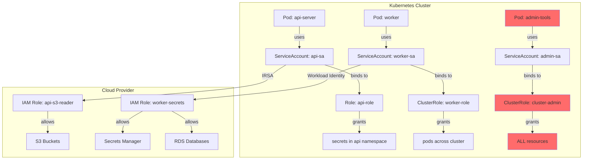

Each workload has an identity (ServiceAccount) that grants access to:
1. **Kubernetes resources** via RBAC (Roles, ClusterRoles)
2. **Cloud resources** via identity federation (IRSA, Workload Identity)

## The Identity Chain

When a pod runs in Kubernetes, it automatically receives credentials via its ServiceAccount. These credentials flow through multiple layers:

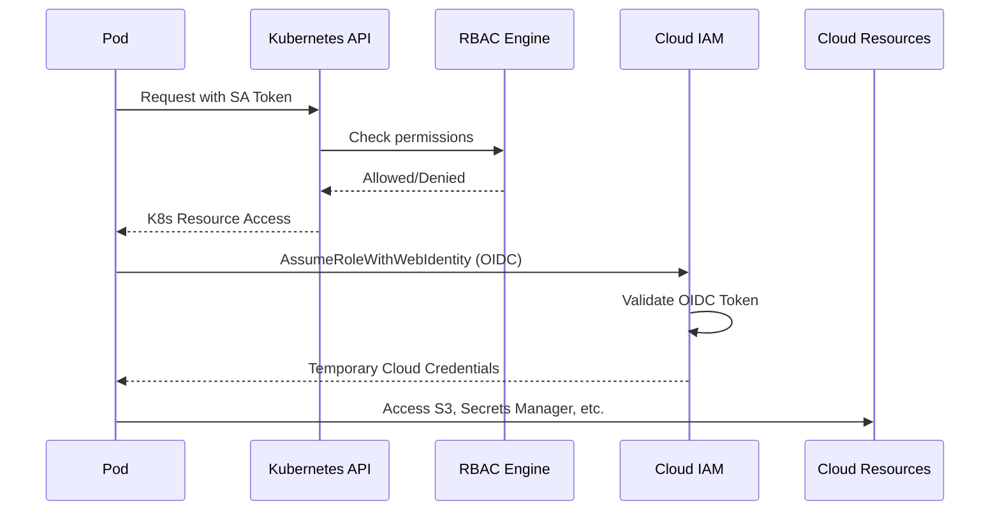

## Blast Radius: What Can an Attacker Access?

If an attacker compromises a workload, they inherit its identity. The blast radius includes everything that identity can reach:

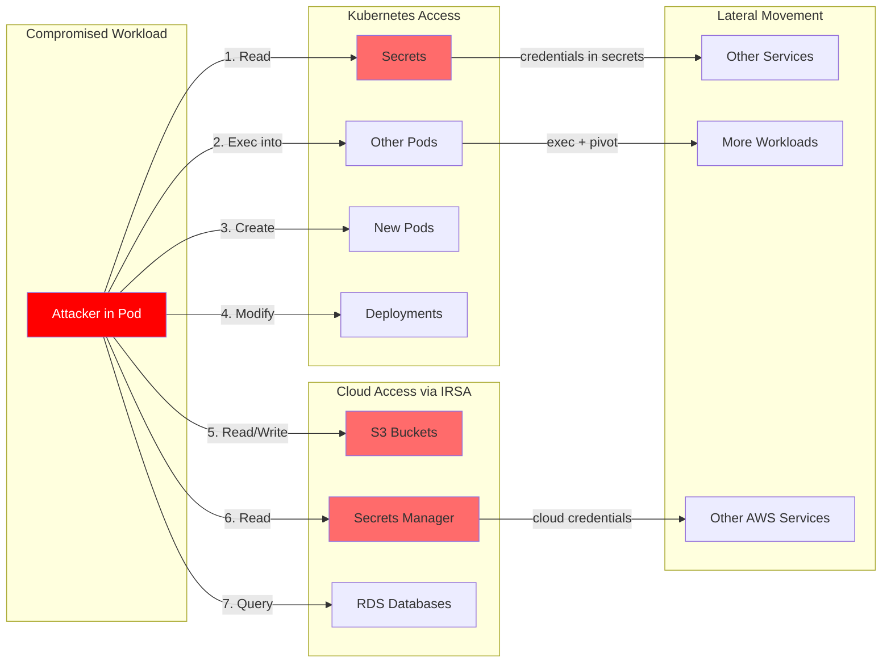

## Real-World Attack Scenarios

### Scenario 1: Secrets Exposure

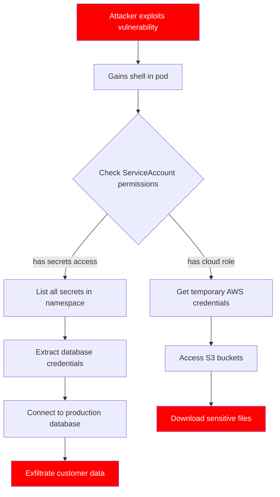

### Scenario 2: Privilege Escalation

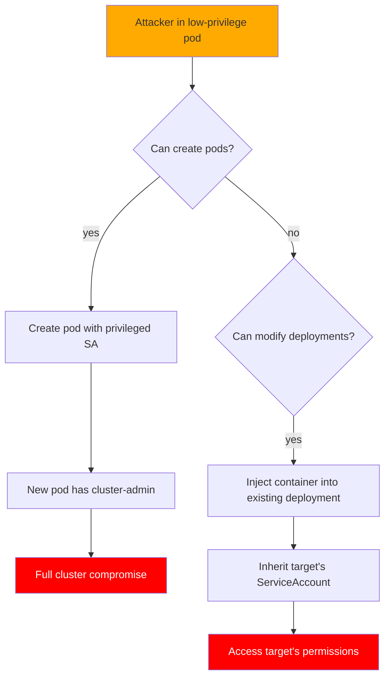

## OpenShift Security Context Constraints

For OpenShift clusters, Identity Chain also analyzes Security Context Constraints (SCCs) - OpenShift's mechanism for controlling what pods can do at the container runtime level.

SCCs control:
- Privileged containers
- Host namespace access (network, PID, IPC)
- Volume types (hostPath, etc.)
- User/group IDs
- Linux capabilities

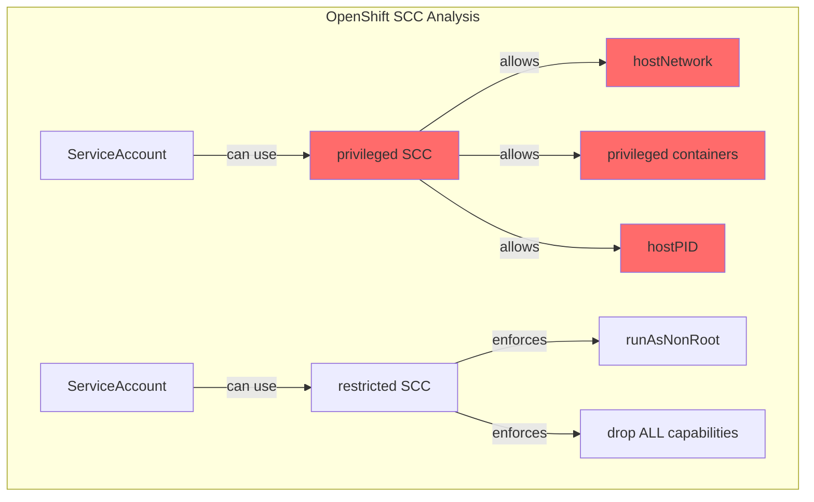

Identity Chain scores each SCC by risk and identifies which service accounts can use privileged SCCs - critical for understanding container escape risk.

## How Identity Chain Helps

Identity Chain (`idc`) automatically maps these relationships and generates an interactive security dashboard:

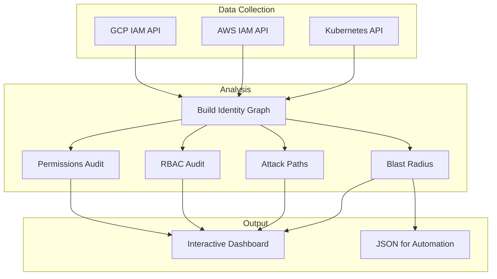

### Example Output

When you run `idc blast --all -A --include-cloud`, you get:

```
Workload: api-server (Deployment)
├── ServiceAccount: api-sa
│   ├── K8s Access:
│   │   ├── [CRITICAL] Can READ ALL SECRETS in api namespace
│   │   ├── [HIGH] Can CREATE/MODIFY PODS - potential container injection
│   │   └── [MEDIUM] Read access to configmaps
│   │
│   └── Cloud Access (AWS IRSA):
│       ├── Role: arn:aws:iam::123456789:role/api-role
│       ├── [HIGH] Read/Write S3 access to ALL buckets
│       └── [CRITICAL] Full Secrets Manager access
│
└── Blast Radius: CRITICAL
    If compromised, attacker can:
    - Read all secrets in namespace (credential exposure)
    - Access all S3 buckets in AWS account
    - Read/write all Secrets Manager secrets
```

## The Graph Model

Identity Chain builds an in-memory graph representing all identity relationships:

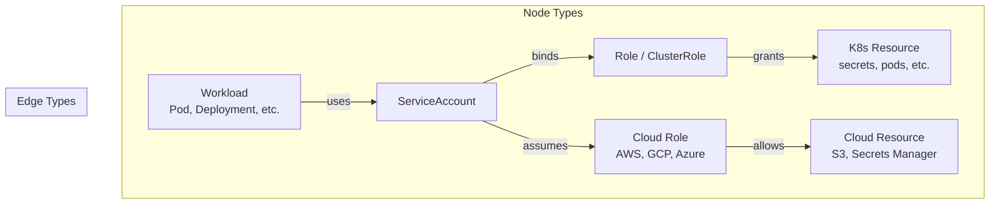

## Risk Classification

Identity Chain classifies risks based on what can be accessed:

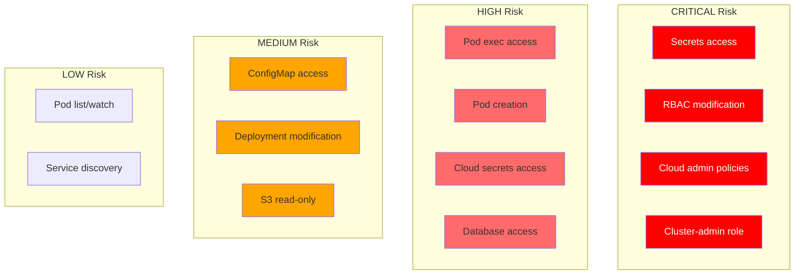

## Use Cases

### Security Assessment

Before deploying to production, understand the blast radius of each workload:

```bash
# Generate comprehensive report
idc blast --all -A --include-cloud --aws-region us-west-2 -o html > security-report.html

# Find critical risks
idc blast --all -A -o json | jq '.[] | select(.max_severity == "critical")'
```

### Incident Response

When a pod is compromised, immediately understand the impact:

```bash
# What can the attacker access from this pod?
idc blast --workload pod/compromised-pod -n production --include-cloud
```

### Compliance & Audit

Demonstrate least-privilege adherence:

```bash
# Find service accounts with secrets access
idc blast --all -A -o json | jq '.[] | select(.k8s_resources[]?.name == "secrets")'

# Find overprivileged cloud access
idc blast --all -A --include-cloud -o json | jq '.[] | select(.cloud_roles[]?.policies[]?.is_admin == true)'
```

## Architecture Deep Dive

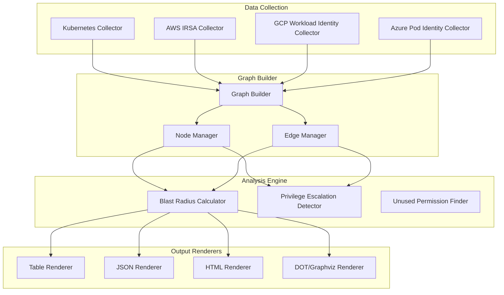

## Getting Started

```bash
# Install via Homebrew
brew install nelssec/tap/idc

# Generate interactive dashboard
idc dashboard -A --include-cloud --aws-region us-west-2 -f dashboard.html
open dashboard.html

# Or run individual commands
idc blast --all -A                    # Blast radius analysis
idc whocan get secrets -A             # Who can access secrets?
idc attack-path --all -A              # Attack path visualization
idc scc -A                            # OpenShift SCC analysis
idc sa-lifecycle -A                   # Find orphaned service accounts
```

## Auto-Remediation

Identity Chain can generate fix manifests for security findings:

```bash
# Generate fixes for all findings
idc remediate -A -f fixes.yaml

# Apply the fixes
kubectl apply -f fixes.yaml
```

This generates ready-to-apply Kubernetes YAML for:
- **RBAC issues**: Replace cluster-admin bindings, remove secrets access, replace wildcards
- **Pod security**: Disable privileged, add security contexts, drop capabilities
- **Network policies**: Create default-deny policies with DNS egress

## Custom Security Checks

Define organization-specific security rules in YAML:

```yaml
checks:
  - id: ORG001
    name: "Production namespace requires resource limits"
    severity: high
    match:
      kind: Workload
      namespacePattern: "^prod-"
    condition:
      missingSecurityField: "resourceLimits"
```

Run custom checks:
```bash
idc check -A --config org-checks.yaml
```

## Multi-Cluster Security Posture

Track security across multiple clusters over time:

```bash
# Configure clusters
idc clusters add --name prod --context prod-eks
idc clusters add --name staging --context staging-eks

# Scan all clusters
idc clusters scan

# Compare security posture
idc trend

# View historical data
idc history --cluster prod
```

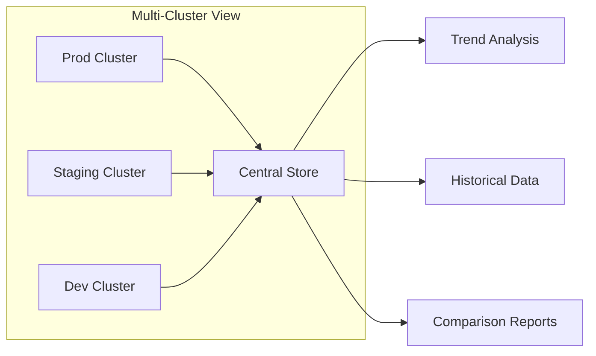

## Conclusion

Understanding the blast radius of Kubernetes workloads is critical for:
- **Prevention**: Identify overprivileged workloads before they're exploited
- **Detection**: Know what to monitor for each identity
- **Response**: Quickly scope the impact of a breach
- **Compliance**: Demonstrate least-privilege implementation

Identity Chain automates this analysis, giving security teams visibility into the complete identity chain from workload to cloud resource.

---

*Identity Chain is open source. Contributions welcome at [github.com/nelssec/identity-chain](https://github.com/nelssec/identity-chain)*
